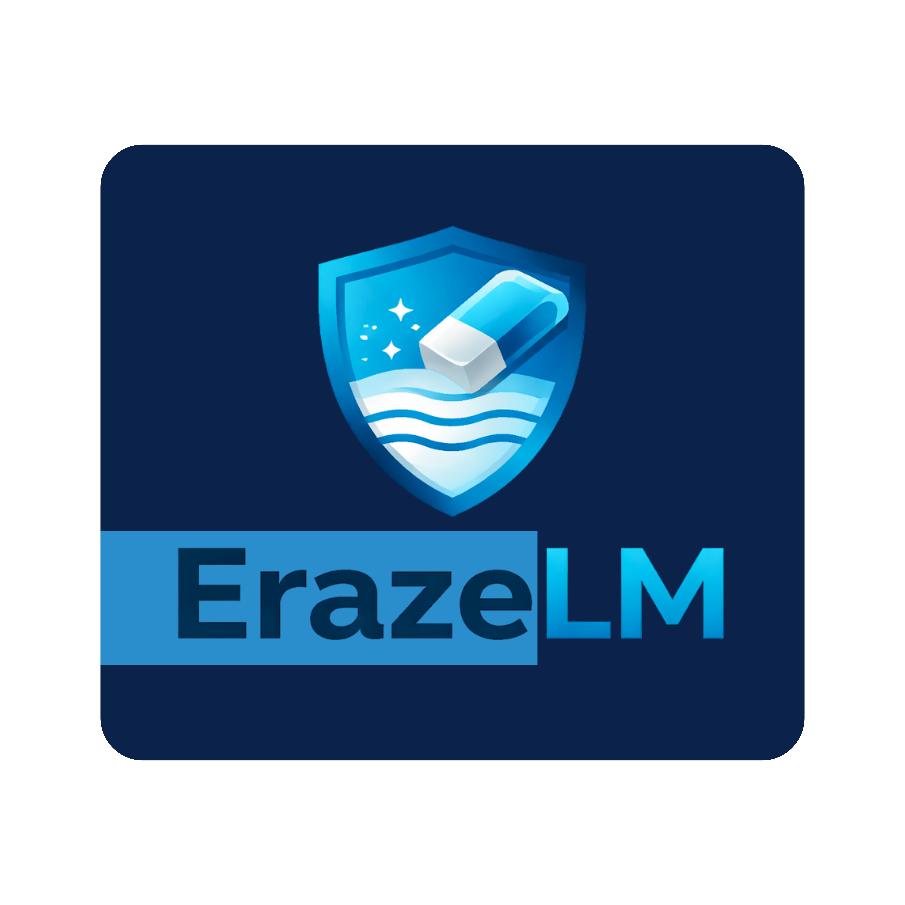

<div align="center">

# ErazeLM


**Advanced AI-Powered Watermark Remover**

[](https://www.python.org/downloads/)
[](https://opensource.org/licenses/MIT)
[](https://flask.palletsprojects.com/)
[](https://opencv.org/)
[](https://github.com/sup-exe)

<p align="center">
  <i>Remove NotebookLM watermarks from PDFs, PPTX files, and images seamlessly without leaving a trace.</i><br>
  <i>Powered by precision OpenCV masking and Telea inpainting.</i>
</p>

[**Features**](#features) •
[**Installation**](#installation) •
[**Web UI**](#web-ui-flask) •
[**CLI Usage**](#cli-usage) •
[**License**](#license)

</div>

<hr/>

## ✨ Features

- **Multi-Format Support**: Works flawlessly on `.pdf`, `.pptx`, `.png`, `.jpg`, `.jpeg`, and `.webp` files.
- **Pixel-Perfect Inpainting**: Uses OpenCV Telea inpainting and median blur to cleanly remove the watermark while preserving surrounding content, backgrounds, and presentation graphics.
- **Vector & Raster PDF Support**: Uses PyMuPDF (`fitz`) to detect vector-based text watermarks and rasterized page watermarks.
- **PPTX Integration**: Extracts slides from PowerPoint archives, cleans them precisely, and safely repacks the archive.
- **Custom Overlays**: Replace the removed watermark region with your own custom branded logo or overlay image.
- **Beautiful Web Interface**: Includes a modern, responsive Flask UI with drag-and-drop support, background processing, progress indicators, and before/after sliders.

## 🚀 Installation

### 1. Clone the Repository
```bash
git clone https://github.com/sup-exe/ErazeLM.git
cd ErazeLM
```

### 2. Set Up a Virtual Environment (Optional but Recommended)
```bash
python -m venv venv
# On Windows
venv\Scripts\activate
# On macOS / Linux
source venv/bin/activate
```

### 3. Install Dependencies
```bash
pip install -r requirements.txt
```
*(Dependencies include `PyMuPDF`, `opencv-python-headless`, `Pillow`, `numpy`, `tqdm`, and `Flask`.)*


## 🌐 Web UI (Flask)

ErazeLM comes with a premium Next.js-inspired web interface. 

To start the Web UI, run:
```bash
python app.py
```
Then, open your browser and navigate to: `http://localhost:5000`

### Web Features:
- Drag & Drop file uploads (up to 200MB).
- Background threaded task processing.
- Elegant progress bars and status updates.
- Real-time **Before & After comparison slider** (for images).
- Optional overlay upload to embed your custom logo instantly.


## 💻 CLI Usage

You can also use ErazeLM via the command line for fast, batch automation.

### Basic Removal
Remove the watermark from a single PDF or image:
```bash
python remover.py input.pdf
```
*This will generate a file named `input_cleaned.pdf` in the same directory.*

### Specify Output Path
```bash
python remover.py input.png -o /path/to/output_clean.png
```

### Batch Directory Processing
Strip watermarks from an entire directory of files at once:
```bash
python remover.py /path/to/folder/
```

### PDF Preview Mode
Need to check detection on the first page quickly before processing a massive 200-page PDF?
```bash
python remover.py massive.pdf --preview
```

### Tuning Detection Margins
If the watermark is located slightly off from the standard bottom-right position:
```bash
python remover.py input.pdf --margin-x 350 --margin-y 80
```


## ⚙️ How It Works under the Hood

1. **Isolation**: ErazeLM isolates the bottom-right corner of the document where the watermark resides.
2. **Difference Masking**: It applies a dynamic median blur to separate the sharp watermark text and icon from the background gradient or image.
3. **Thresholding & Filtering**: Connected components are grouped, and structural filtering ensures slide borders or text aren't accidentally selected.
4. **Inpainting**: Using OpenCV's `INPAINT_TELEA` algorithm, the selected watermark mask is filled in by smoothly bleeding the surrounding background pixels over the text.


## 📜 Disclaimer
This software is built for educational and productivity purposes. Please ensure you have the appropriate legal rights, permissions, or ownership over the documents and presentations you are modifying. The author (`sup-exe`) is not responsible for any misuse of this tool.


## 📄 License
This project is licensed under the **MIT License**. See the [LICENSE](LICENSE) file for details.

---
<div align="center">
  <b>Built with ❤️ by <a href="https://github.com/sup-exe">sup-exe</a></b>
</div>
